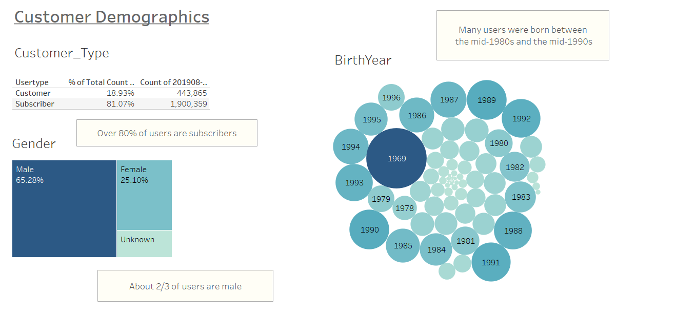

#   NY Citibike with Tableau (Module 14)

[Link to Jupyter Notebook code](NYC_CitiBike_Challenge.ipynb)

[Link Tableau Public Dashboard](https://public.tableau.com/app/profile/neil.ralston/viz/Module_14_Bikesharing_Challenge/Challenge_Story?publish=yes)

## NY Citibike with Tableau

### Overview
The purpose of this project is to create a business proposal for a bike-sharing program in Des Moines.

This proposal is based on assessments of data available from the CitiBike program in New York City.

https://ride.citibikenyc.com/system-data

Using Tableau Public, created a dashboard story with the following visualizations:

* Bike-sharing program demographic data
* Assessment of bike-sharing start and end locations
* Assessment of bike trip duration
* Assessment of bike trips by day 
* Assessment of bike trips by hour

## Results

Each visualization includes a key take-away summary, which are reproduced below.

1. Demographic Data

* Over 80% of users are subscribers
* About 2/3 are users are male
* Many users were born between the mid-1980s and the mid-1990s

2. Start and End Locations
* Highest density start and end locations are in close proximity to each other 
* The sliders on each map can be adjusted to explore a different range of map results

3. Bike Trip Duration
* Most trips are less than 1/2 hour in duration

4. Bike Trips by Day
* Most trips on all days are by male subscribers

5. Bike Trips by Hour
* Weekday peak hours are 7-9am and 5-7pm
* Weekend peak hours are mid-day

## Summary

This assessment suggests that a small-market bike-sharing program should initially focus on weekday commuters.

Marketing should focus primarily on potential repeat users (subscribers) who are between 25 and 35 years old.

The following visualizations should also be considered:
* Purpose for bike trip (work, leisure, etc.)
* Top 10 start and end locations by ride count

### Resources

This project was prepared using the following:
* Tableau Public
* Python 3.7.6
* Jupyter Notebook 6.4.5
